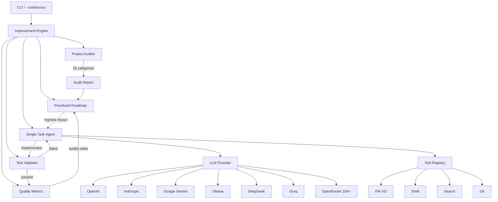

<div align="center">


# AutoAgent

[](https://opensource.org/licenses/MIT)
[](https://www.python.org/downloads/)
[]()
[]()

**AutoAgent — a self-improving AI coding agent with a premium desktop dashboard.**
Give it a goal — it audits your project, builds a roadmap, then autonomously
implements, tests, and measures improvements in a continuous loop.

</div>

## The Flow

1. **You provide a high-level goal** — e.g., "Transform this into a AAA-quality driving game"
2. **The AI performs a complete project audit** — analyzing the codebase, architecture, gameplay systems, UI, performance, audio, lighting, animations, physics, AI, and game design to identify weaknesses
3. **The Planner generates a prioritized roadmap** — breaking the project into improvements grouped by category (graphics, physics, AI, vehicles, world design, optimization, UI, audio, etc.)
4. **The Improvement Engine enters an autonomous loop:**
   - Picks the highest-impact improvement
   - Implements it
   - Tests the project (did anything break?)
   - Measures quality and performance
   - Updates the roadmap
   - Repeats
5. **Terminates when:** the target quality threshold is reached, no meaningful improvements remain, the user stops the process, or resource limits are reached.

## Core Concept

Rather than asking "What should I do next?", the AI continually asks:

- **What is the biggest weakness in the current project?**
- **What improvement will most increase quality?**
- **Can I implement it safely?**
- **Did it actually make the project better?**
- **What should I improve next?**

This creates a self-improving development loop.

## Features

- **Self-Improving Engine** — Continuous audit → roadmap → implement → test → measure → repeat loop
- **Premium Desktop App** — Dark neon dashboard with 8 pages: Dashboard, Projects, Agents, Agent Activity, Code Explorer, Metrics, Tools, Settings
- **Live Monitoring** — Real-time quality gauges, CPU/RAM meters, activity feed with search, sparkline charts, toast notifications
- **Comprehensive Auditor** — Analyzes 16 categories (graphics, physics, AI, vehicles, world, optimization, UI, audio, etc.)
- **Prioritized Roadmap** — Impact-scored backlog with dependency tracking and automatic reprioritization
- **Quality Metrics** — Tracks quality over time with category-level scoring, trend analysis, and target thresholds
- **Test Validator** — Verifies improvements don't break the project (custom test functions, file checks, command checks)
- **14 Pluggable LLM Providers** — OpenAI, Anthropic, Gemini, Ollama, DeepSeek, Groq, Together, Fireworks, Perplexity, xAI, OpenRouter, Qwen, Kimi, GLM
- **Built-in Model Catalog** — **185+ models** in a Settings dropdown; free models are labelled **(Free — No API Key needed)** / **(Free)** and the key field disables itself for keyless models
- **Dark & Light Themes** — switch instantly with the ☀ / ☾ button in the top bar (or in Settings); your choice, window size, and every setting are remembered between sessions
- **Extensible Tools** — File I/O, shell execution, regex/grep search, glob file matching, git operations
- **Safety First** — Shell sandboxing blocks dangerous commands; file writes restricted to workspace
- **pip-Installable** — Single command install with `aicoder` CLI entry point

## Quickstart

### Option A: Download & Double-Click (Windows — easiest)

1. Click the green **Code** button above → **Download ZIP**
2. Extract the ZIP anywhere
3. Double-click **`run.bat`**
   - First run: dependencies install automatically (takes ~1 minute)
   - Every run after: the app opens instantly, no console window
4. Click ⚙ Settings, pick a provider and a model from the dropdown (free ones are labelled), paste your API key if needed, set a goal, press **▶ Run**

> **"Publisher cannot be verified"?** That's standard Windows behavior for files
> downloaded from the internet — click **Run**. You only need Python installed
> ([python.org](https://python.org), tick "Add Python to PATH").

### Option B: Standalone .exe (no Python needed)

1. Go to [Releases](https://github.com/jaydenqiu51/AutoAgent-VersionCode/releases)
2. Download **AICoder.exe**
3. Double-click it — the desktop app opens immediately, no install needed
4. Enter your API key, set a goal, and click **Start Engine**

### Option C: Launch Desktop App from Source

```bash
git clone https://github.com/jaydenqiu51/AutoAgent-VersionCode.git
cd AutoAgent-VersionCode
pip install -e .
aicoder --gui
```

### Option D: CLI from Source

```bash
# 1. Install
git clone https://github.com/jaydenqiu51/AutoAgent-VersionCode.git
cd AutoAgent-VersionCode
pip install -e .

# 2. Configure (Windows PowerShell)
$env:OPENAI_API_KEY = "sk-..."

# 3. Run

# Single task mode
aicoder "Add input validation to src/auth.py"

# Interactive mode
aicoder --interactive

# CONTINUOUS SELF-IMPROVING MODE (the real power)
aicoder --continuous "Transform this into a AAA-quality driving game"

# With quality target and iteration limit
aicoder -c --target 90 --max-iterations 200 "Make this project production-ready"

# With local model
aicoder -c --provider ollama --model codellama "Improve code quality"
```

### Build Your Own .exe

```bash
pip install pyinstaller
python build.py          # Builds AICoder.exe (GUI)
python build.py --cli    # Builds aicoder.exe (CLI)
```

Output goes to `dist/AICoder.exe` — a single file you can share or put on a USB stick.

## Supported LLM Providers

Prices are **per 1 million tokens** (input / output), in **US Dollars (USD $)**.

<!-- PRICING:START -->
| Provider | Model | Price per 1M tokens, USD (in / out) | API Key? | How to Get a Key |
|----------|-------|-------------------------------------|----------|-------------------|
| **Ollama** | codellama, llama3, etc. | **$0 — completely FREE** | ❌ **No key needed** | [ollama.com](https://ollama.com) — just install it |
| **Google Gemini** | gemini-2.5-flash | **FREE tier** (paid: $0.30 / $2.50) | Free key | [aistudio.google.com](https://aistudio.google.com/apikey) |
| **Groq** | llama-3.3-70b-versatile | **FREE tier** (paid: $0.59 / $0.79) | Free key | [console.groq.com](https://console.groq.com) |
| **GLM (Zhipu AI)** | glm-4-flash | **FREE** | Free key | [open.bigmodel.cn](https://open.bigmodel.cn) |
| **OpenRouter** | 100+ models, many `:free` | **FREE** (`:free` models) and up | Free key | [openrouter.ai/keys](https://openrouter.ai/keys) |
| **DeepSeek** | deepseek-chat | $0.27 / $1.12 | Paid key | [platform.deepseek.com](https://platform.deepseek.com) |
| **Qwen (Alibaba)** | qwen-plus | $0.26 / $0.78 | Paid key | [dashscope.aliyun.com](https://dashscope.console.aliyun.com) |
| **Kimi (Moonshot)** | kimi-k3 | $3.00 / $15.00 | Paid key | [platform.moonshot.cn](https://platform.moonshot.cn) |
|  | kimi-k2.7-code | $0.70 / $3.50 |  |  |
| **Together AI** | Llama 3.3 70B Turbo | $0.88 / $0.88 (+ free models) | Key (has free models) | [together.ai](https://together.ai) |
| **Fireworks** | Llama 3.3 70B | $0.90 / $0.90 | Paid key | [fireworks.ai](https://fireworks.ai) |
| **OpenAI** | gpt-4o | $2.50 / $10.00 | Paid key | [platform.openai.com](https://platform.openai.com) |
|  | gpt-4o-mini | $0.15 / $0.60 |  |  |
|  | gpt-4.1 | $2.00 / $8.00 |  |  |
| **Anthropic** | claude-sonnet-4 | $3.00 / $15.00 | Paid key | [console.anthropic.com](https://console.anthropic.com) |
|  | claude-opus-4 | $15.00 / $75.00 |  |  |
|  | claude-3-5-haiku | $0.80 / $4.00 |  |  |
| **Perplexity** | sonar-pro | $3.00 / $15.00 (+ search fees) | Paid key | [perplexity.ai](https://docs.perplexity.ai) |
| **xAI (Grok)** | grok-3 | $3.00 / $15.00 | Paid key | [x.ai/api](https://x.ai/api) |

_All prices in USD ($) · Last updated: 2026-08-12 00:08 UTC · auto-refreshes every 2 hours_
<!-- PRICING:END -->

<!-- MODELS:START -->
<details>
<summary><b>📋 Full Model Catalog</b> — every model built into the app, with live USD prices (click to expand)</summary>

| Provider | Model(s) | Price per 1M tokens, USD (in / out) |
|----------|----------|--------------------------------------|
| OpenAI | `gpt-4o` | $2.50 / $10.00 |
| OpenAI | `gpt-4o-mini` | $0.15 / $0.60 |
| OpenAI | `chatgpt-4o-latest` | see provider site |
| OpenAI | `gpt-4.1` | $2.00 / $8.00 |
| OpenAI | `gpt-4.1-mini` | $0.40 / $1.60 |
| OpenAI | `gpt-4.1-nano` | $0.10 / $0.40 |
| OpenAI | `gpt-4.5-preview` | see provider site |
| OpenAI | `gpt-4-turbo` | $10.00 / $30.00 |
| OpenAI | `gpt-4` | $30.00 / $60.00 |
| OpenAI | `gpt-3.5-turbo` | $0.50 / $1.50 |
| OpenAI | `o1` | $15.00 / $60.00 |
| OpenAI | `o1-mini` | see provider site |
| OpenAI | `o1-pro` | $150.00 / $600.00 |
| OpenAI | `o3` | $2.00 / $8.00 |
| OpenAI | `o3-pro` | $20.00 / $80.00 |
| OpenAI | `o3-mini` | $1.10 / $4.40 |
| OpenAI | `o4-mini` | $1.10 / $4.40 |
| Anthropic | `claude-opus-4` | $15.00 / $75.00 |
| Anthropic | `claude-sonnet-4` | $3.00 / $15.00 |
| Anthropic | `claude-3-7-sonnet` | see provider site |
| Anthropic | `claude-3-5-sonnet` | see provider site |
| Anthropic | `claude-3-5-sonnet-20240620` | see provider site |
| Anthropic | `claude-3-5-haiku` | see provider site |
| Anthropic | `claude-3-opus` | see provider site |
| Anthropic | `claude-3-sonnet` | see provider site |
| Anthropic | `claude-3-haiku` | $0.25 / $1.25 |
| Google Gemini | `gemini-2.5-flash` | **FREE tier** (paid: $0.30 / $2.50) |
| Google Gemini | `gemini-2.5-flash-lite` | **FREE tier** (paid: $0.10 / $0.40) |
| Google Gemini | `gemini-2.0-flash` | **FREE** (with free key) |
| Google Gemini | `gemini-2.0-flash-lite` | **FREE** (with free key) |
| Google Gemini | `gemini-2.0-flash-thinking-exp` | **FREE** (with free key) |
| Google Gemini | `gemini-1.5-flash` | **FREE** (with free key) |
| Google Gemini | `gemini-1.5-flash-8b` | **FREE** (with free key) |
| Google Gemini | `gemma-3-27b-it` | **FREE tier** (paid: $0.08 / $0.45) |
| Google Gemini | `gemini-2.5-pro` | $1.25 / $10.00 |
| Google Gemini | `gemini-1.5-pro` | see provider site |
| Ollama (local) | `llama3.3` | **FREE — No API Key needed** |
| Ollama (local) | `llama3.2` | **FREE — No API Key needed** |
| Ollama (local) | `llama3.2-vision` | **FREE — No API Key needed** |
| Ollama (local) | `llama3.1` | **FREE — No API Key needed** |
| Ollama (local) | `llama3` | **FREE — No API Key needed** |
| Ollama (local) | `llama2` | **FREE — No API Key needed** |
| Ollama (local) | `codellama` | **FREE — No API Key needed** |
| Ollama (local) | `qwen3` | **FREE — No API Key needed** |
| Ollama (local) | `qwen2.5` | **FREE — No API Key needed** |
| Ollama (local) | `qwen2.5-coder` | **FREE — No API Key needed** |
| Ollama (local) | `qwq` | **FREE — No API Key needed** |
| Ollama (local) | `deepseek-r1` | **FREE — No API Key needed** |
| Ollama (local) | `deepseek-coder-v2` | **FREE — No API Key needed** |
| Ollama (local) | `deepseek-v3` | **FREE — No API Key needed** |
| Ollama (local) | `mistral` | **FREE — No API Key needed** |
| Ollama (local) | `mistral-nemo` | **FREE — No API Key needed** |
| Ollama (local) | `mistral-small` | **FREE — No API Key needed** |
| Ollama (local) | `mixtral` | **FREE — No API Key needed** |
| Ollama (local) | `codestral` | **FREE — No API Key needed** |
| Ollama (local) | `phi4` | **FREE — No API Key needed** |
| Ollama (local) | `phi4-mini` | **FREE — No API Key needed** |
| Ollama (local) | `phi3` | **FREE — No API Key needed** |
| Ollama (local) | `gemma3` | **FREE — No API Key needed** |
| Ollama (local) | `gemma2` | **FREE — No API Key needed** |
| Ollama (local) | `codegemma` | **FREE — No API Key needed** |
| Ollama (local) | `starcoder2` | **FREE — No API Key needed** |
| Ollama (local) | `granite3.3` | **FREE — No API Key needed** |
| Ollama (local) | `command-r` | **FREE — No API Key needed** |
| Ollama (local) | `command-r-plus` | **FREE — No API Key needed** |
| Ollama (local) | `llava` | **FREE — No API Key needed** |
| Ollama (local) | `tinyllama` | **FREE — No API Key needed** |
| Ollama (local) | `smollm2` | **FREE — No API Key needed** |
| Ollama (local) | `dolphin3` | **FREE — No API Key needed** |
| Ollama (local) | `olmo2` | **FREE — No API Key needed** |
| Ollama (local) | `openthinker` | **FREE — No API Key needed** |
| DeepSeek | `deepseek-chat` | $0.27 / $1.12 |
| DeepSeek | `deepseek-reasoner` | $0.70 / $2.50 |
| Groq | `llama-3.3-70b-versatile` | **FREE** (with free key) |
| Groq | `llama-3.1-8b-instant` | **FREE** (with free key) |
| Groq | `llama3-70b-8192` | **FREE** (with free key) |
| Groq | `llama3-8b-8192` | **FREE** (with free key) |
| Groq | `llama-4-scout-17b-16e-instruct` | **FREE** (with free key) |
| Groq | `llama-4-maverick-17b-128e-instruct` | **FREE** (with free key) |
| Groq | `deepseek-r1-distill-llama-70b` | **FREE** (with free key) |
| Groq | `qwen-qwq-32b` | **FREE** (with free key) |
| Groq | `qwen-2.5-coder-32b` | **FREE** (with free key) |
| Groq | `qwen-2.5-32b` | **FREE** (with free key) |
| Groq | `gemma2-9b-it` | **FREE** (with free key) |
| Groq | `mistral-saba-24b` | **FREE** (with free key) |
| Groq | `allam-2-7b` | **FREE** (with free key) |
| Together AI | `Llama-3.3-70B-Instruct-Turbo-Free` | **FREE** (with free key) |
| Together AI | `DeepSeek-R1-Distill-Llama-70B-free` | **FREE** (with free key) |
| Together AI | `Llama-3.3-70B-Instruct-Turbo` | $0.10 / $0.32 |
| Together AI | `Llama-3.1-405B-Instruct-Turbo` | see provider site |
| Together AI | `Llama-3.1-70B-Instruct-Turbo` | $0.40 / $0.40 |
| Together AI | `Llama-3.1-8B-Instruct-Turbo` | $0.05 / $0.08 |
| Together AI | `Llama-4-Maverick-17B-128E` | $0.20 / $0.70 |
| Together AI | `Llama-4-Scout-17B-16E` | $0.10 / $0.30 |
| Together AI | `Qwen2.5-72B-Instruct-Turbo` | $0.36 / $0.40 |
| Together AI | `Qwen2.5-Coder-32B-Instruct` | $0.66 / $1.00 |
| Together AI | `Qwen3-235B-A22B` | $0.45 / $1.82 |
| Together AI | `QwQ-32B` | see provider site |
| Together AI | `DeepSeek-V3` | $0.27 / $1.12 |
| Together AI | `DeepSeek-R1` | $0.70 / $2.50 |
| Together AI | `Mixtral-8x7B-Instruct` | see provider site |
| Together AI | `Mixtral-8x22B-Instruct` | $2.00 / $6.00 |
| Together AI | `Mistral-Small-24B-Instruct` | $0.05 / $0.08 |
| Together AI | `gemma-2-27b-it` | $0.65 / $0.65 |
| Fireworks | `llama-v3p3-70b-instruct` | $0.10 / $0.32 |
| Fireworks | `llama-v3p1-405b-instruct` | see provider site |
| Fireworks | `llama-v3p1-70b-instruct` | $0.40 / $0.40 |
| Fireworks | `llama-v3p1-8b-instruct` | $0.05 / $0.08 |
| Fireworks | `llama4-maverick-instruct-basic` | $0.20 / $0.70 |
| Fireworks | `llama4-scout-instruct-basic` | $0.10 / $0.30 |
| Fireworks | `qwen2p5-coder-32b-instruct` | $0.66 / $1.00 |
| Fireworks | `qwen2p5-72b-instruct` | $0.36 / $0.40 |
| Fireworks | `qwen3-235b-a22b` | $0.45 / $1.82 |
| Fireworks | `qwq-32b` | see provider site |
| Fireworks | `deepseek-v3` | $0.27 / $1.12 |
| Fireworks | `deepseek-r1` | $0.70 / $2.50 |
| Fireworks | `mixtral-8x22b-instruct` | $2.00 / $6.00 |
| Fireworks | `mistral-small-24b-instruct` | $0.05 / $0.08 |
| Perplexity | `sonar` | $1.00 / $1.00 |
| Perplexity | `sonar-pro` | $3.00 / $15.00 |
| Perplexity | `sonar-reasoning` | see provider site |
| Perplexity | `sonar-reasoning-pro` | $2.00 / $8.00 |
| Perplexity | `sonar-deep-research` | $2.00 / $8.00 |
| Perplexity | `r1-1776` | see provider site |
| xAI (Grok) | `grok-4` | see provider site |
| xAI (Grok) | `grok-3` | see provider site |
| xAI (Grok) | `grok-3-mini` | see provider site |
| xAI (Grok) | `grok-3-fast` | see provider site |
| xAI (Grok) | `grok-3-mini-fast` | see provider site |
| xAI (Grok) | `grok-2` | see provider site |
| xAI (Grok) | `grok-2-vision` | see provider site |
| OpenRouter | `llama-3.3-70b-instruct:free` | **FREE** (with free key) |
| OpenRouter | `llama-4-scout:free` | **FREE** (with free key) |
| OpenRouter | `deepseek-chat-v3-0324:free` | **FREE** (with free key) |
| OpenRouter | `deepseek-r1:free` | **FREE** (with free key) |
| OpenRouter | `deepseek-r1-0528:free` | **FREE** (with free key) |
| OpenRouter | `gemma-3-27b-it:free` | **FREE** (with free key) |
| OpenRouter | `gemini-2.0-flash-exp:free` | **FREE** (with free key) |
| OpenRouter | `qwen-2.5-coder-32b-instruct:free` | **FREE** (with free key) |
| OpenRouter | `qwen3-235b-a22b:free` | **FREE** (with free key) |
| OpenRouter | `qwq-32b:free` | **FREE** (with free key) |
| OpenRouter | `mistral-small-3.1-24b-instruct:free` | **FREE** (with free key) |
| OpenRouter | `mistral-7b-instruct:free` | **FREE** (with free key) |
| OpenRouter | `kimi-k2:free` | **FREE** (with free key) |
| OpenRouter | `glm-4.5-air:free` | **FREE** (with free key) |
| OpenRouter | `openai/gpt-4o` | $2.50 / $10.00 |
| OpenRouter | `openai/gpt-4.1` | $2.00 / $8.00 |
| OpenRouter | `anthropic/claude-sonnet-4` | $3.00 / $15.00 |
| OpenRouter | `anthropic/claude-opus-4` | $15.00 / $75.00 |
| OpenRouter | `google/gemini-2.5-pro` | $1.25 / $10.00 |
| OpenRouter | `google/gemini-2.5-flash` | $0.30 / $2.50 |
| OpenRouter | `x-ai/grok-4` | see provider site |
| OpenRouter | `deepseek/deepseek-chat-v3-0324` | $0.27 / $1.12 |
| OpenRouter | `moonshotai/kimi-k3` | $3.00 / $15.00 |
| OpenRouter | `moonshotai/kimi-k2.7-code` | $0.70 / $3.50 |
| OpenRouter | `meta-llama/llama-3.3-70b-instruct` | $0.10 / $0.32 |
| OpenRouter | `mistralai/mistral-large-2411` | see provider site |
| Qwen (Alibaba) | `qwen-max` | see provider site |
| Qwen (Alibaba) | `qwen-plus` | $0.26 / $0.78 |
| Qwen (Alibaba) | `qwen-turbo` | see provider site |
| Qwen (Alibaba) | `qwen-long` | see provider site |
| Qwen (Alibaba) | `qwen3-coder-plus` | $0.30 / $1.00 |
| Qwen (Alibaba) | `qwen3-coder-flash` | see provider site |
| Qwen (Alibaba) | `qwen-vl-max` | see provider site |
| Qwen (Alibaba) | `qwen-vl-plus` | see provider site |
| Qwen (Alibaba) | `qwen-math-plus` | see provider site |
| Qwen (Alibaba) | `qwq-plus` | see provider site |
| Kimi (Moonshot) | `kimi-k3` | $3.00 / $15.00 |
| Kimi (Moonshot) | `kimi-k2.7-code` | $0.70 / $3.50 |
| Kimi (Moonshot) | `kimi-k2.7-code-highspeed` | see provider site |
| Kimi (Moonshot) | `kimi-k2.6` | $0.95 / $4.00 |
| Kimi (Moonshot) | `kimi-k2.5` | $0.57 / $2.85 |
| GLM (Zhipu AI) | `glm-4-flash` | **FREE** (with free key) |
| GLM (Zhipu AI) | `glm-4-flashx` | **FREE** (with free key) |
| GLM (Zhipu AI) | `glm-4.5-flash` | **FREE** (with free key) |
| GLM (Zhipu AI) | `glm-4.5` | $0.60 / $2.20 |
| GLM (Zhipu AI) | `glm-4.5-air` | $0.13 / $0.85 |
| GLM (Zhipu AI) | `glm-4.5-x` | see provider site |
| GLM (Zhipu AI) | `glm-4.5-airx` | see provider site |
| GLM (Zhipu AI) | `glm-4-plus` | see provider site |
| GLM (Zhipu AI) | `glm-4-air` | see provider site |
| GLM (Zhipu AI) | `glm-4-airx` | see provider site |
| GLM (Zhipu AI) | `glm-4-long` | see provider site |
| GLM (Zhipu AI) | `glm-4v-plus` | see provider site |
| GLM (Zhipu AI) | `glm-z1-air` | see provider site |

_All prices in USD ($) · Last updated: 2026-08-12 00:08 UTC · auto-refreshes every 2 hours_

</details>
<!-- MODELS:END -->

### 🆓 Use It Completely Free — No API Key

The **Ollama** provider needs **no API key at all** — models run locally on your PC:

1. Install [Ollama](https://ollama.com) (free)
2. In a terminal: `ollama pull llama3.2` (or `codellama`, `qwen2.5-coder`, `deepseek-r1`…)
3. In AutoAgent Settings, pick provider **ollama** — every model in the dropdown shows
   **(Free — No API Key needed)** and the API key box disables itself
4. Press ▶ Run. Zero cost, zero sign-up, works offline

**Free cloud models** (need only a free account key, no payment): every model marked
**(Free)** in the app's Settings dropdown — including `gemini-2.5-flash`, all Groq models,
`glm-4-flash`, and every OpenRouter model ending in `:free`.
The in-app model catalog covers all 14 providers and is kept updated with each release.

### Environment Variables

Set the right env var for your provider:

```bash
# OpenAI
$env:OPENAI_API_KEY = "sk-..."

# Anthropic
$env:ANTHROPIC_API_KEY = "sk-ant-..."

# Google Gemini (FREE tier available!)
$env:GEMINI_API_KEY = "AIza..."

# DeepSeek (cheapest strong coder)
$env:DEEPSEEK_API_KEY = "sk-..."

# Groq (FREE tier available!)
$env:GROQ_API_KEY = "gsk_..."

# OpenRouter (100+ models, some FREE)
$env:OPENROUTER_API_KEY = "sk-or-..."

# Or set once for any provider:
$env:AICODER_API_KEY = "your-key"
```

### CLI Examples with Providers

```bash
# Free: Google Gemini
aicoder -p gemini -m gemini-2.5-flash "Add error handling"

# Free: Groq (fastest inference)
aicoder -p groq -m llama-3.3-70b-versatile "Refactor auth"

# Cheapest strong coder: DeepSeek
aicoder -p deepseek "Optimize the renderer"

# Local: Ollama (no API key, no internet)
aicoder -p ollama -m codellama "Write unit tests"

# OpenRouter: access any model through one API
aicoder -p openrouter -m "google/gemma-3-27b-it:free" "Review code"
```

## Architecture



## Usage as a Library

```python
from aicoder.core.engine import ImprovementEngine
from aicoder.core.tester import Tester, make_command_check
from aicoder.core.tool_registry import ToolRegistry
from aicoder.llm.openai_provider import OpenAIProvider
from aicoder.tools.file_tools import ReadFileTool, WriteFileTool

# Set up
provider = OpenAIProvider(model="gpt-4o")
registry = ToolRegistry()
registry.register(ReadFileTool())
registry.register(WriteFileTool())
# ... register more tools

# Custom tester
tester = Tester()
tester.add_check(make_command_check("lint", "flake8 ."))

# Run the engine
engine = ImprovementEngine(
    goal="Transform this into a AAA-quality game",
    provider=provider,
    tool_registry=registry,
    tester=tester,
    target_quality=90.0,
    max_iterations=200,
    on_phase=lambda phase, msg: print(f"[{phase}] {msg}"),
    on_improvement=lambda iid, title, result: print(f"  Done: {title}"),
    on_quality=lambda before, after, trend: print(f"  Quality: {before:.0f} -> {after:.0f}"),
)

report = engine.run()
print(report)
```

## Configuration

| Variable | Default | Description |
|----------|---------|-------------|
| `AICODER_PROVIDER` | `openai` | LLM provider |
| `AICODER_MODEL` | `gpt-4o` | Model name |
| `AICODER_API_KEY` | — | API key |
| `AICODER_WORKSPACE` | `.` (cwd) | Workspace root |
| `AICODER_MAX_TOKENS` | `8000` | Max tokens per request |
| `AICODER_MAX_ITERATIONS` | `25` | Max agent loop iterations (single task) |
| `AICODER_TEMPERATURE` | `0.2` | LLM temperature |

## Project Structure

```
AutoAgent-VersionCode/
├── README.md
├── LICENSE
├── setup.py
├── build.py                    # PyInstaller packaging → standalone .exe
├── run.bat                     # Windows launcher (auto-installs deps on first run)
├── run.pyw                     # Zero-console launcher (double-click)
├── aicoder/
│   ├── cli.py                  # CLI: --gui, --continuous, --interactive
│   ├── gui.py                  # Premium desktop dashboard (tkinter) — 8 pages, live gauges
│   ├── logo.png                # App icon / emblem
│   ├── config.py               # Env-var configuration
│   ├── core/
│   │   ├── agent.py            # Single-task ReAct agent
│   │   ├── engine.py           # Continuous self-improving loop
│   │   ├── auditor.py          # 16-category project audit
│   │   ├── roadmap.py          # Prioritized backlog with dependencies
│   │   ├── metrics.py          # Quality tracking & measurement
│   │   ├── tester.py           # Test validation framework
│   │   ├── memory.py           # Conversation memory
│   │   ├── planner.py          # Task decomposition
│   │   └── tool_registry.py    # Tool registration
│   ├── llm/                    # Pluggable LLM providers
│   ├── tools/                  # 10 built-in tools
│   └── prompts/                # System prompts
└── examples/
    └── basic_usage.py
```

## License

MIT © 2026 Jayden Qiu
